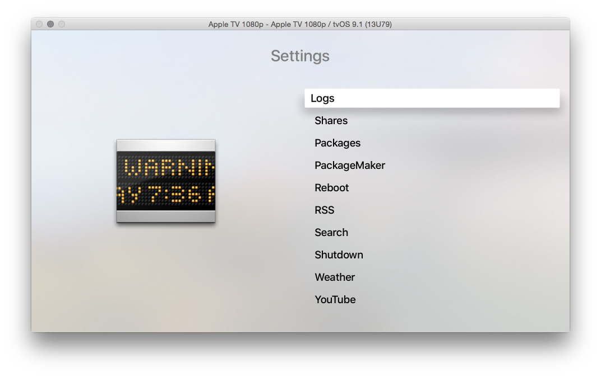

# tvOSSettingsView
Basic settings style view for tvOS

I couldn't find a single example or tutorial online for what should have been a VERY basic view to create (It was SUPER easy on prior AppleTV's all the way up to tvOS). This should get you started on making a basic view like this.

Black background

Clear background

